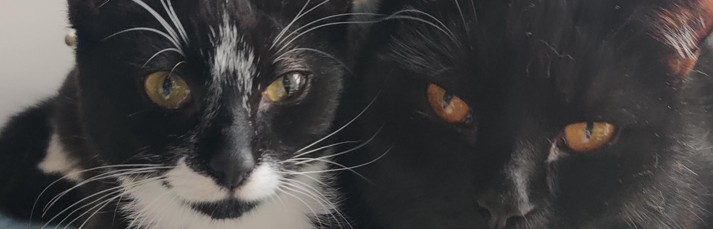

(To run a frontend (HTML, CSS, Javascript only) application in the terminal, type:
'python3 -m http.server')

Introduction
Cat Corner
Welcome to Cat Corner a website dedicated to lovers of cats and coffee! I used my own two cats Diablo and Persephone and built a website around them. The site's audience if for anyone who likes cats and relaxation.

Prepation Phase
I began by brainstorming the concept and creating a wire frame on Figma for the skeleton for the website.

The audience for my website is for cat loving adults so I wanted to achieve a sleek and robut website.
I decided on the colours black white and purple for the design element for a nice contrast and style.
I collected images for the website and took a video for the background.

Features
Nav bar 

Present on all pages the nav bar is fully accessible and responsive for users to navigate through the website.
Hero Image 

This landing image anchors the home page and capture's user attention.
Footer
Directs the user to external sociaL media links.

Gallery 
!cat lying on purple bed](https://github.com/donaltwo/project1-cat-corner/assets/155965788/58078bdc-8aec-4303-8307-180ede2e26fb)
The gallery features mutiple images of the two cats for the website.

Booking form 

Has a usable form to complete booking require information be completed before being submitted.
Video background

Testing
To highlight an initial misunderstanding of mine as this was my first time using Github was that I would make very minor changes, fixing a typo, coding a single line etc and would save committed the changes and push to see the effected changes reflected in my local copy of the website.
This is why there is over 250+ commits present on the website, I wanted to make note of it as a rookie error that I've learnt from.

| ACTION | EXPECTED BEHAVIOUR| PASS/FAIL|
| ------------- | ------------- |-------------|
| Nav bar home text clicked.| Take user to home page when clicked. | PASS |
| Nav bar bookings text clicked.| Take user to booking form page when clicked. | PASS |
| Nav bar FAQ text clciked.| Take user to FAQ page when clicked. | PASS |
| Nav bar Gallery text clicked.| Take user to gallery page when clicked. | PASS |
| Booking form requires text to completete. | Message displays correctly. | PASS |
| Booking form submit clicked. | takes user to confirmation page | PASS |

Lighthouse

Validator Testing
HTML
CSS

Unfixed Bugs
Due to time constarints

Deployment

Media
All the images and video were taken by myself Donal Twomey and therefore my own works that are displayed.

Credits & Acknowledgements
Thanks to the online resources and my mentor Dick V. who aided me in creating this project! 
Code Isnitiute Love Running Project
Font Awesome Kit for icons and Javascript line: https://fontawesome.com/
W3schools.com:
https://www.w3schools.com/css/css_display_visibility.asp
https://www.w3schools.com/css/css_image_gallery.asp
Hubspot:
https://blog.hubspot.com/marketing/hero-image
Mozilla:
https://developer.mozilla.org/en-US/docs/Web/CSS/background-size
